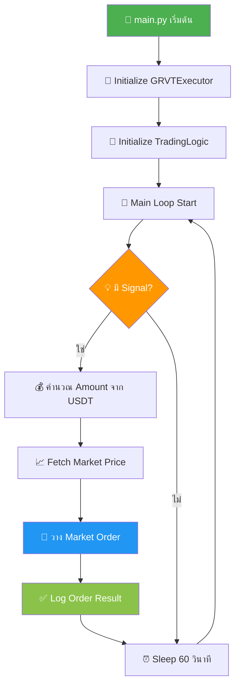

# 📊 สรุปโปรเจค GRVT Demo Bot

โปรเจคนี้เป็น **Trading Bot สำหรับ GRVT Exchange** (ทั้ง Testnet และ Production) ที่ทำงานได้แบบ standalone และออกแบบมาเพื่อเทรด Perpetual Futures โดยอัตโนมัติ

## 🎯 วัตถุประสงค์

สร้างบอทสำหรับเทรด Perpetual Futures (BTC_USDT_Perp) บน GRVT exchange โดยใช้ leverage และมี trading logic แบบอัตโนมัติที่สามารถปรับเปลี่ยนกลยุทธ์ได้ตามต้องการ

---

## 📂 โครงสร้างไฟล์หลัก

| ไฟล์ | หน้าที่ | รายละเอียด |
|------|---------|------------|
| [main.py](file:///e:/work/week1_01_26/bot_test/grvt_demo_bot/main.py) | Entry Point | จุดเริ่มต้นของโปรแกรม รัน main loop เพื่อดึง signal และส่งคำสั่ง order |
| [config.py](file:///e:/work/week1_01_26/bot_test/grvt_demo_bot/config.py) | Configuration | เก็บ API Key, Private Key, Account ID, Symbol, Leverage, Order Size |
| [execution.py](file:///e:/work/week1_01_26/bot_test/grvt_demo_bot/execution.py) | Order Execution | จัดการการเชื่อมต่อกับ GRVT API, authentication, และการวาง order ต่างๆ |
| [trading_logic.py](file:///e:/work/week1_01_26/bot_test/grvt_demo_bot/trading_logic.py) | Strategy Logic | ส่วนของกลยุทธ์การเทรด (ปัจจุบันใช้ random signal เพื่อ demo) |
| [check_leverage.py](file:///e:/work/week1_01_26/bot_test/grvt_demo_bot/check_leverage.py) | Leverage Management | ตรวจสอบและจัดการ leverage setting |
| [requirements.txt](file:///e:/work/week1_01_26/bot_test/grvt_demo_bot/requirements.txt) | Dependencies | รายการ Python packages ที่ต้องติดตั้ง |
| `tests/` | Testing Suite | Integration tests ที่ทดสอบกับ API จริง |
| `pysdk/` | SDK Library | Local copy ของ GRVT Python SDK |

---

## ⚙️ การทำงานของบอท



### ขั้นตอนการทำงาน:

1. **เชื่อมต่อ**: เชื่อมต่อกับ GRVT Exchange ผ่าน `pysdk` library
2. **วนลูป**: ตรวจสอบ trading signal ทุก 60 วินาที (ตั้งค่าได้ใน `MAIN_LOOP_INTERVAL`)
3. **วิเคราะห์**: เมื่อได้ signal (buy/sell) จะดึงราคาตลาดปัจจุบัน
4. **คำนวณ**: แปลง order size จาก USDT เป็น base currency amount
5. **สั่งซื้อ**: วาง market order ผ่าน GRVT API
6. **บันทึก**: บันทึก log ลงไฟล์ `grvt_bot.log` และแสดงบน console

---

## 🔧 การตั้งค่าปัจจุบัน

จากไฟล์ [config.py](file:///e:/work/week1_01_26/bot_test/grvt_demo_bot/config.py):

```python
GRVT_ENV = "testnet"                    # Environment: testnet or prod
SYMBOL = "BTC_USDT_Perp"                # Trading pair
LEVERAGE = 10                           # Leverage multiplier
ORDER_SIZE_USDT = 500                   # Size ต่อ signal (USDT)
MAIN_LOOP_INTERVAL = 60                 # Loop interval (seconds)
```

### พารามิเตอร์สำคัญ:

- **Environment**: ใช้ `testnet` เพื่อทดสอบอย่างปลอดภัย
- **Symbol**: BTC Perpetual Future vs USDT
- **Leverage**: 10x (⚠️ ต้องตั้งค่าบน GRVT web interface ด้วยตัวเอง)
- **Order Size**: 500 USDT ต่อ signal (ตรงตามข้อกำหนด minimum notional)
- **Loop Interval**: ตรวจสอบ signal ทุก 60 วินาที

---

## 🏗️ สถาปัตยกรรมของโค้ด

### 1. Main Loop (`main.py`)

```python
while True:
    signal = strategy.get_signal()
    if signal:
        price = executor.get_market_price(SYMBOL)
        amount_base = ORDER_SIZE_USDT / price
        executor.place_market_order(SYMBOL, side, amount_base)
    time.sleep(MAIN_LOOP_INTERVAL)
```

### 2. Executor Class (`execution.py`)

คลาส `GRVTExecutor` ประกอบด้วย methods หลัก:

| Method | ความสามารถ |
|--------|-----------|
| `initialize_client()` | สร้างการเชื่อมต่อกับ GRVT API |
| `get_market_price()` | ดึงราคาตลาดปัจจุบัน |
| `place_market_order()` | วาง market order |
| `place_limit_order()` | วาง limit order |
| `set_leverage()` | ตั้งค่า leverage (ถ้า API รองรับ) |
| `close_all_positions()` | ปิดทุก position ของ symbol |
| `get_account_summary()` | ดึงข้อมูล account balance |

### 3. Trading Logic (`trading_logic.py`)

ส่วนที่ใช้สร้าง trading signals - ปัจจุบันเป็น **random signal generator** เพื่อ demonstration:

```python
def get_signal(self):
    # Random buy/sell signal for demo purposes
    # แทนที่ส่วนนี้ด้วยกลยุทธ์จริง (MA, RSI, etc.)
    pass
```

---

## ✨ จุดเด่นของโปรเจค

### 1. **Self-contained Architecture**
- มี `pysdk/` folder ในโปรเจคเอง
- ไม่ต้องพึ่ง external SDK installation
- รัน standalone ได้ทันที

### 2. **Flexible & Modular Design**
- แยกส่วนการทำงานออกเป็น modules ชัดเจน
- เปลี่ยนกลยุทธ์ใน `trading_logic.py` ได้ง่าย
- ปรับแต่ง order execution ใน `execution.py` ได้อิสระ

### 3. **Complete Logging System**
- บันทึกทุก action, error, และ order detail
- Save log ลงไฟล์ `grvt_bot.log`
- แสดง real-time log บน console

### 4. **Testing Infrastructure**
- มี integration tests พร้อมใช้งาน
- ทดสอบกับ API จริง (ระวัง: จะส่ง order จริง!)
- Verify functionality ก่อน deploy

### 5. **Error Handling**
- Try-catch ครอบคลุมทุก critical section
- Graceful error recovery
- Detailed error logging with traceback

---

## 🚀 วิธีใช้งาน

### ขั้นตอนที่ 1: ติดตั้ง Dependencies

```bash
# ติดตั้ง required packages
pip install -r requirements.txt
```

### ขั้นตอนที่ 2: ตั้งค่า Configuration

แก้ไขไฟล์ [config.py](file:///e:/work/week1_01_26/bot_test/grvt_demo_bot/config.py):

```python
# ใส่ API credentials จริงของคุณ
GRVT_API_KEY = "your_api_key_here"
GRVT_PRIVATE_KEY = "0x..."
GRVT_TRADING_ACCOUNT_ID = "your_account_id"
GRVT_SUB_ACCOUNT_ID = "0"
```

### ขั้นตอนที่ 3: ตั้งค่า Leverage บน Web Interface

> [!IMPORTANT]
> **ต้องตั้งค่า leverage ด้วยตัวเองบน GRVT web interface ก่อนรันบอท!**
> 
> บอทจะใช้ leverage ที่ตั้งไว้บน account แต่ไม่สามารถเปลี่ยนค่าได้อัตโนมัติผ่าน API

### ขั้นตอนที่ 4: รันบอท

```bash
python main.py
```

### ขั้นตอนที่ 5: รัน Tests (Optional)

```bash
pytest tests/
```

---

## ⚠️ ข้อควรระวัง

> [!CAUTION]
> **ความเสี่ยงในการใช้งาน:**
> 
> 1. **Real Money Risk**: Tests และ bot จะส่ง order **จริง** ไปที่ exchange
> 2. **Leverage Risk**: การใช้ leverage 10x มีความเสี่ยงสูง อาจขาดทุนเกินเงินต้น
> 3. **Testnet First**: ทดสอบบน testnet ก่อน**เสมอ** ก่อนใช้งาน production
> 4. **Manual Leverage**: ต้องตั้ง leverage บน web interface ด้วยตัวเอง
> 5. **API Keys Security**: อย่า commit API keys เข้า git repository

> [!WARNING]
> **ข้อจำกัดของ Demo:**
> 
> - `trading_logic.py` ปัจจุบันใช้ **random signal** เท่านั้น
> - ไม่มี risk management หรือ position sizing แบบ dynamic
> - ไม่มี stop loss / take profit อัตโนมัติ
> - ต้องพัฒนา strategy จริงก่อนใช้งาน production

---

## 🔄 การปรับแต่งและพัฒนาต่อ

### เปลี่ยนกลยุทธ์การเทรด

แก้ไข [trading_logic.py](file:///e:/work/week1_01_26/bot_test/grvt_demo_bot/trading_logic.py) เพื่อใช้กลยุทธ์ที่แท้จริง:

**ตัวอย่าง: MA Crossover Strategy**

```python
class TradingLogic:
    def __init__(self):
        self.short_ma = []
        self.long_ma = []
    
    def get_signal(self):
        # คำนวณ Moving Average
        # สร้าง buy signal เมื่อ short MA ตัดขึ้น long MA
        # สร้าง sell signal เมื่อ short MA ตัดลง long MA
        pass
```

**ตัวอย่าง: RSI Strategy**

```python
class TradingLogic:
    def get_signal(self):
        rsi = self.calculate_rsi()
        if rsi < 30:  # Oversold
            return {'side': 'buy'}
        elif rsi > 70:  # Overbought
            return {'side': 'sell'}
        return None
```

### เพิ่ม Risk Management

แก้ไข [execution.py](file:///e:/work/week1_01_26/bot_test/grvt_demo_bot/execution.py) เพื่อเพิ่มฟีเจอร์:

- **Stop Loss**: วาง stop order อัตโนมัติ
- **Take Profit**: ตั้ง target price
- **Position Sizing**: คำนวณ size จาก risk percentage
- **Max Position Limit**: จำกัดจำนวน position พร้อมกัน

---

## 📊 Log Files และ Monitoring

### Log Format

```
2026-01-25 10:30:15 - main - INFO - Starting GRVT Demo Bot...
2026-01-25 10:30:15 - execution - INFO - Initialized GRVT client for env: testnet
2026-01-25 10:30:20 - main - INFO - Signal received: {'side': 'buy', 'amount_usdt': 500}
2026-01-25 10:30:21 - execution - INFO - Market Order placed: ABC123XYZ
```

### สิ่งที่บันทึกใน Log:

- ✅ Bot initialization status
- ✅ Trading signals ที่ได้รับ
- ✅ Order executions (order ID, side, amount)
- ✅ Market price ที่ใช้คำนวณ
- ✅ Errors และ exceptions ทั้งหมด
- ✅ Traceback สำหรับ debugging

---

## 🧪 Testing

### Test Structure

```
tests/
├── test_execution.py       # ทดสอบ GRVTExecutor
├── test_trading_logic.py   # ทดสอบ strategy logic
└── test_integration.py     # ทดสอบ end-to-end flow
```

### การรัน Tests

```bash
# รัน all tests
pytest tests/

# รัน specific test file
pytest tests/test_execution.py

# รัน with verbose output
pytest tests/ -v

# รัน with coverage report
pytest tests/ --cov=.
```

> [!WARNING]
> **ระวัง**: Integration tests จะส่ง **order จริง** ไปที่ exchange ตาม environment ที่ตั้งใน [config.py](file:///e:/work/week1_01_26/bot_test/grvt_demo_bot/config.py)

---

## 🛠️ Troubleshooting

### ปัญหาที่พบบ่อย

**1. ModuleNotFoundError: No module named 'pysdk'**

```bash
# Solution: เพิ่ม current directory เข้า Python path
import sys
import os
sys.path.append(os.path.dirname(os.path.abspath(__file__)))
```

**2. Order failed: Leverage not set**

```
Solution: ตั้ง leverage บน GRVT web interface ก่อนรันบอท
```

**3. Order failed: Minimum notional requirement**

```
Solution: เพิ่ม ORDER_SIZE_USDT ใน config.py ให้มากกว่า minimum ที่กำหนด
```

**4. Authentication failed**

```
Solution: ตรวจสอบ API_KEY, PRIVATE_KEY, และ ACCOUNT_ID ใน config.py
```

---

## 📚 เอกสารเพิ่มเติม

- [README.md](file:///e:/work/week1_01_26/bot_test/grvt_demo_bot/README.md) - Basic documentation (English)
- [README_TH.md](file:///e:/work/week1_01_26/bot_test/grvt_demo_bot/README_TH.md) - คำแนะนำพื้นฐาน (ภาษาไทย)
- [LEVERAGE_FIX.md](file:///e:/work/week1_01_26/bot_test/grvt_demo_bot/LEVERAGE_FIX.md) - วิธีแก้ปัญหา leverage setting

---

## 🔐 Security Best Practices

> [!CAUTION]
> **ความปลอดภัยของ API Keys:**

1. ✅ **อย่า commit** `config.py` ที่มี API keys เข้า git
2. ✅ **ใช้ `.gitignore`** เพื่อป้องกันไฟล์ sensitive
3. ✅ **ใช้ environment variables** สำหรับ production
4. ✅ **Rotate keys** เป็นประจำ
5. ✅ **จำกัด permissions** ของ API key ให้เหมาะสม (เฉพาะ trading)

---

## 📈 Roadmap และการพัฒนาต่อ

### ฟีเจอร์ที่ควรเพิ่ม:

- [ ] **Real Strategy Implementation**: แทนที่ random signal ด้วย strategy จริง
- [ ] **Stop Loss / Take Profit**: เพิ่ม risk management
- [ ] **Position Management**: ติดตาม และจัดการ open positions
- [ ] **Performance Metrics**: วัดผล win rate, profit/loss, drawdown
- [ ] **Webhook Integration**: รับ signal จาก TradingView หรือ external sources
- [ ] **Multi-symbol Support**: เทรดหลาย pairs พร้อมกัน
- [ ] **Database Logging**: บันทึก trades ลง database
- [ ] **Dashboard/UI**: Web interface สำหรับ monitor bot

---

## 📞 สรุป

โปรเจค **GRVT Demo Bot** เป็น foundation ที่ดีสำหรับการพัฒนา trading bot บน GRVT exchange โดยมีโครงสร้างที่:

- ✅ **Modular** - แยกส่วนการทำงานชัดเจน
- ✅ **Self-contained** - มี dependencies ครบ ไม่ต้องติดตั้งเพิ่ม
- ✅ **Flexible** - ปรับแต่ง strategy ได้ง่าย
- ✅ **Testable** - มี test suite พร้อมใช้
- ✅ **Production-ready** - พร้อม deploy หลังแก้ strategy

**Next Steps:**
1. ศึกษาโครงสร้างโค้ดให้เข้าใจ
2. ทดสอบบน testnet
3. พัฒนา trading strategy ของคุณเอง
4. เพิ่ม risk management
5. Backtest และ optimize strategy
6. Deploy บน production (ระมัดระวัง!)

---

*สร้างเมื่อ: 2026-01-25*  
*โปรเจค: GRVT Demo Bot*  
*Environment: Testnet*
